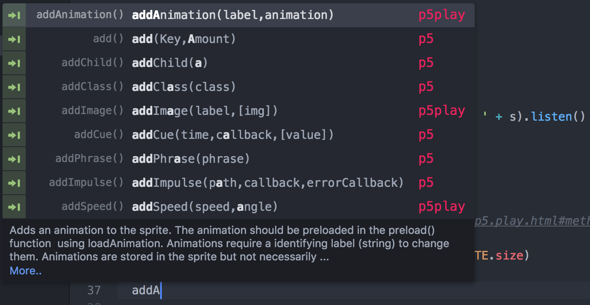

# p5play-snippets

[p5.play](http://p5play.molleindustria.org/) snippets for [atom.io](http://atom.io)

### Features

  + auto complete suggestions
  + a short description of each p5 function
  + 'More...' link to the p5 reference
  + tab breakpoints at each p5 function's arguments
  + friendly p5 logo to help distinguish p5 specific functions
  + right click p5js functions within your sketch, and use the contextual menu to `Find in the p5js reference`

### How to install it

Don't forget to restart atom after install.

### How to use it

TODO

### How to edit/build it

<!-- Last compiled for p5.js@ 0.6.0 -->

To build the snippets from http://p5play.molleindustria.org/docs/data.json:

 + `cd` to the `build` folder
 + `npm install`
 + `node build.js`
